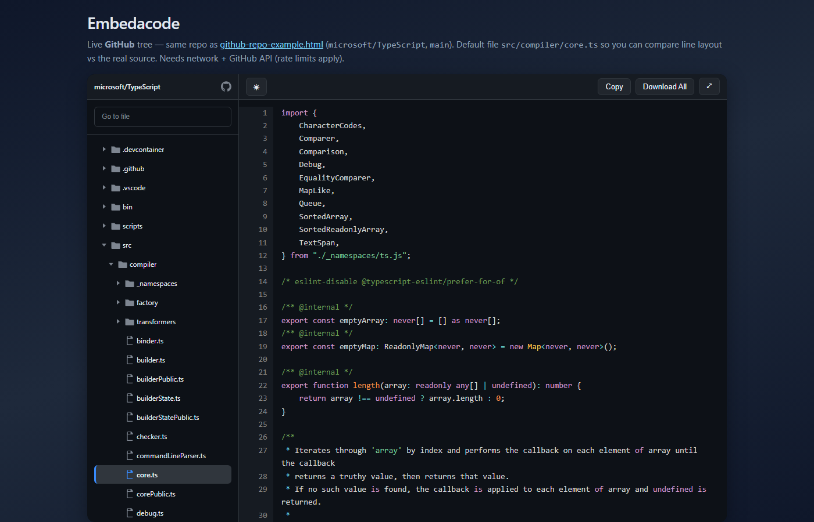

# Embedacode

**Embedacode** is a **read-only** code viewer for **articles, tutorials, courses, and docs**: a **file tree**, **Prism** syntax highlighting, **copy** and **download**, and optional **per-file descriptions**. You do **not** need GitHub to use it.

**Two common setups:**

1. **Snippets and hand-built trees** — Pass a `files` array: each entry is a path plus `content` (a string, or a URL to fetch when the user opens that file). Use this for one-off examples, multi-file walkthroughs, or any static JSON you control. No repository, no API keys.
2. **Whole public GitHub repos (optional)** — Set `repoUrl` (and optionally `branch`, `defaultFile`) to load a real tree and file bodies from the **GitHub API**. Great for companion repos; skip it if you only want inline code.

Either way, readers get a focused viewer instead of a full IDE or a live playground.

The component is a **Lit** `<embeda-code>` custom element with styles **scoped to its shadow DOM**, so it **won’t fight your site or application CSS**. Theme it with the `theme` attribute and CSS variables on the host when you want it to match your brand.

Ship via **one script tag** (standalone bundle) or **npm** (GitHub Packages).



> Screenshot: [`examples/script-tag-example.html`](examples/script-tag-example.html) using the **optional** `repoUrl` demo. The **minimal** path is `files` only (see the **Script tag** section below). Demo image filename is unchanged for stable links.

## Repo layout

| Path | Role |
|------|------|
| `src/editor/` | `<embeda-code>` and its styles |
| `src/highlight/` | Prism wiring, size guards, `prepareCodeView` |
| `src/tree/` | Path → folder tree, merge/override lists |
| `src/github/` | Repo listing from the GitHub API |
| `src/types.ts` | Config / file types shared by the above |
| `examples/` | HTML demos (build first, then serve repo root) |
| `docs/` | README screenshot and other static assets |
| `e2e/` | Playwright; HTML fixtures under `e2e/fixtures/` |

## Install (GitHub Packages)

```bash
npm install @mikehenken/embedacode
```

`.npmrc`:

```
@mikehenken:registry=https://npm.pkg.github.com
```

## Script tag

The standalone build bundles Lit and Prism into one file: `dist/embedacode.standalone.js`.

```html
<script src="./dist/embedacode.standalone.js"></script>
<embeda-code id="editor"></embeda-code>
<script>
  document.addEventListener('DOMContentLoaded', () => {
    document.getElementById('editor').config = {
      files: [
        { path: 'src/index.ts', content: 'console.log("hi");', language: 'typescript' },
      ],
    };
  });
</script>
```

**Live GitHub demo** (optional feature): [examples/script-tag-example.html](https://github.com/mikehenken/embedacode/blob/main/examples/script-tag-example.html). **Minimal HTML** (repo URL only, no page chrome): [examples/github-repo-example.html](https://github.com/mikehenken/embedacode/blob/main/examples/github-repo-example.html).

Pinned release asset (no npm):

```html
<script src="https://github.com/mikehenken/embedacode/releases/download/v2.1.0/embedacode.standalone.js"></script>
```

## npm / bundler

```javascript
import '@mikehenken/embedacode';
```

The import registers the custom element; there is no default export. Set `element.config` after the node exists.

**Module entrypoints** (after build):

| File | Role |
|------|------|
| `dist/embedacode.es.js` | ESM for bundlers |
| `dist/embedacode.umd.js` | UMD (CommonJS / script environments that expect UMD) |
| `dist/embedacode.standalone.js` | Single-file bundle (Lit + Prism included) |

## Config

Use **`files` alone** for snippets and static trees. Add **`repoUrl`** only when you want to pull from a public GitHub repository (it merges with `files`; your `files` entries override paths that clash).

**File object**

| Field | Required | Notes |
|-------|----------|--------|
| `path` | yes | Tree label, e.g. `src/app.ts` |
| `content` | yes | String or URL (fetched when the file is selected) |
| `language` | no | Prism id: `typescript`, `json`, `markdown`, … |
| `description` | no | Shown under the code when this file is active |

**Top-level `config`**

| Field | Notes |
|-------|--------|
| `files` | File objects; paths with `/` build nested folders |
| `repoUrl` | GitHub HTTPS URL; merges with `files` (same path = your `files` entry wins) |
| `branch` | Branch for `repoUrl` (default `main`) |
| `tag` | Tag for `repoUrl`; overrides `branch` when set |
| `showFileDescription` | `false` hides the description strip entirely |
| `sidebarHeader` | Optional `{ title?, repoUrl? }` above the tree |
| `remoteCacheMaxEntries` | How many URL-fetched bodies to keep (default `1`; raise for a small LRU) |
| `wordWrap` | Long lines wrap (default `true`; set `false` for horizontal scroll). When `true`, the view uses a **CSS Grid** (one row per logical line) so the gutter stays aligned with wrapped text; when `false`, a classic dual-`pre` layout is used. |
| `defaultFile` | Normalized path to open first (e.g. `README.md`). If omitted and `repoUrl` is set, root `README.md` is opened when present |

## GitHub repos (optional)

```javascript
editor.config = {
  repoUrl: 'https://github.com/owner/repo',
  branch: 'develop', // optional
};
```

Tree API is capped at **2500** entries client-side. Folders start **collapsed**; the initial file’s parent folders expand automatically. With `repoUrl` and no `defaultFile`, the first **README.md** (root, then nested) is selected when it exists.

The sidebar includes a **Go to file** filter (substring match on paths and names).

Unauthenticated API calls count against GitHub’s **60/hour** limit; heavy sites should proxy with a token. Raw file fetches and the tree API are fine from the browser (CORS).

## Remote `content` URLs

```javascript
editor.config = {
  files: [
    {
      path: 'package.json',
      content: 'https://raw.githubusercontent.com/microsoft/TypeScript/main/package.json',
      language: 'json',
    },
  ],
};
```

Needs CORS-friendly URLs. Default cache keeps one remote body; bump `remoteCacheMaxEntries` if you want back/forward without refetch.

## Toolbar behavior

- **Copy** — current file text to clipboard  
- **Download all** — zip of every file in the tree  
- **Theme** — light/dark; stored as `embedacode-theme` in `localStorage` (first paint follows `prefers-color-scheme`, else dark)  
- **Fullscreen** — Escape exits  

CSS variables on `:host` still override colors if you need a custom skin.
